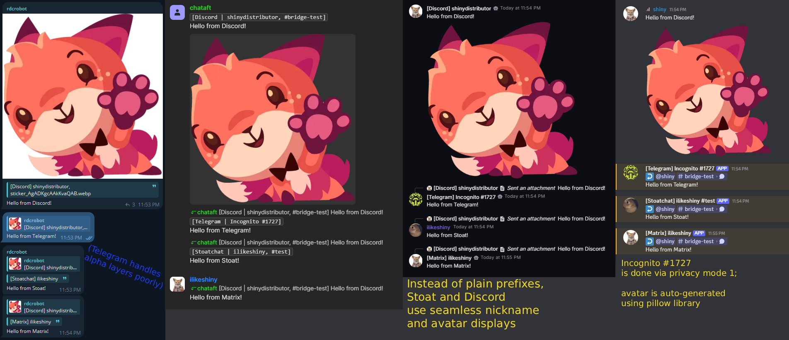
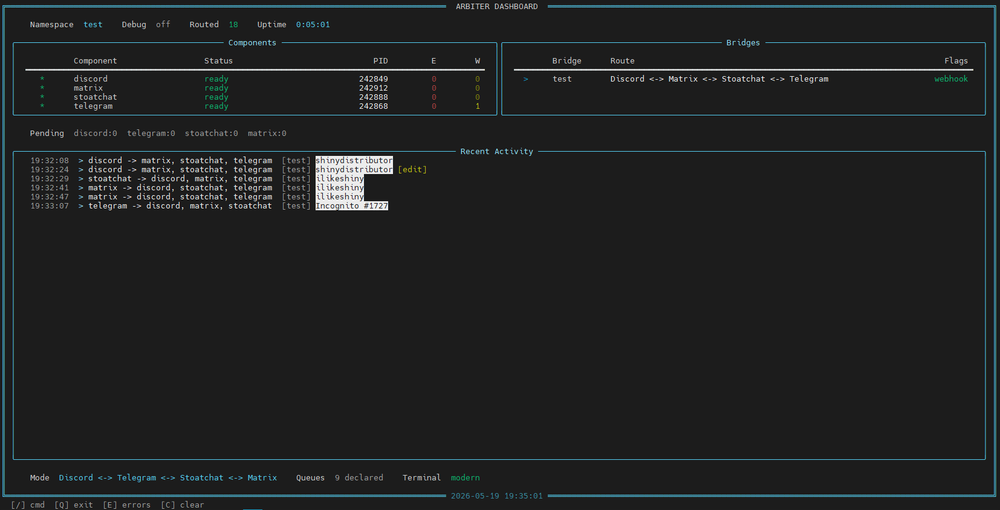

# CHATAFT - Comprehensive Hosted Autonomous Transmitting Architecture For ...Toasting?

TL;DR: A multi-modular, mult-platform bridging bot for shitposters &amp; niche communities alike!  

# About the project: 

This have been a project of mine for the past year; but since the great (upcoming) fall of Discord due to Palantir association, i've been seeing a lot of the new platforms pop up from thin air, confusing people as to where to go instead of actually helping them migrate. It started as a simple, two-way Telegram <--> Discord bridge i've made because all other opensource projects didn't have basic embed dl functionality, and i didn't feel like paying for hosting services.
So after the massive revamp i've done in February 2026, this project aims to be a migration &amp; history preservation tool for a large variety of communities - niche chatrooms, art channels and shitposts. 

All battle tested in the [REDAFT](https://t.me/the_redaft/) community

> [!TIP]
> The features:
> - catch-up of missed messages during bot's downtime or component crash - thanks to RabbitMQ's resilient queues;
> - full chat exports from discord (telegram wip);
> - intelligent message ordering by time: perfect chat history preservation;
> - smart discord cdn embed pulling: automatic detection of raw media vs rich embeds;
> - large variety of supported media types: stickers, emojis, system messages and so on (spoilers also supported!);
> - seamless discord &amp; stoat integration: full webhook and masquerade support with avatar pulling and webhook reply bypassing (referencing the message link instead of legacy reply);
> - fully functional rich dashboard with real-time updates;
> - support for discord's threads and telegram's topics;
> - up to 4 way bridging (with more platforms to come);
> - auto maintenance with configurable restarts;
> - two privacy modes - omit nicknames or ignore user completely;
> - discord read-only clientbot implementation via slim-link file (r/w if using webhooks);
> - auto-leave in unauthorized groups;
> - and more!

# Screenshots
Messages Preview

Arbiter Live Dashboard Preview


> [!TIP]
> Changelogs:

<details> <summary>9.9.26 1.2 - QoL</summary> 

- added auto-restarts <br>
- revamped -restartconfig <br>
- improvements to embed detection (klipy and youtube should work fine now) <br>
- imports now self-disable themselves when done to avoid confusion
- fixed link replacements to be handled post-transform on discord's side
- sooo many fixes for DB storage cleanups, message mapping deduplications, extended matrix compatibility and many many other little things <br>

this update tackles many issues because i'm not using git repositories as intended and instead upload bulk updates i've been working on for months, so these "1.1, 1.2" actually matter

<details> <summary>5.20.26 1.1</summary> 
    - New arbiter hints and dynamic scaling capabilities <br>
    - Full Discord clientbot functionality added via slim-link file (you must install the lib via the scripts/install_clientbot.sh because discord.py-self mimics discord.py and will replace it instead) <br>
    - Privacy modes with automatic hash-based avatar and number generation (shown in screenshots above) <br>
    - Mime media types resilience <br>
    - Realtime link replacements for wrappers <br>
    - Matrix now accepts login:pass and renews daily tokens automatically <br>
    - and more meticulous edge case fixes! <br>
</details>

> [!WARNING]
> Cons:
> - tedious setup, not plug-n-play: have to install and configure Erlang and RabbitMQ;
> - fully generated by LLMs - probably not an issue for most people these days - especially when considering the human intent behind the project. there was a lot of bumproads along the way, but i've managed to fix all the minor issues and lead the project to it's current, well-polished state (3+ weeks uptime guaranteed)
> - a lot of edge-case scenarios are to be expected, because i'm the only one who used the project, and i cannot presume what would a regular user do. please file an issue if you walk into one of these scenarios.

> [!NOTE]
> What's planned:
> - full Matrix AS mode support (when i get funds to buy a domain and a decent VPS);
> - (X)Twitter receive-only support (API is costly there);
> - Bluesky two-way support;
> - Possibly Slack and Mattermost, but not sure if that's my scope;
> - Telegram webhooks and clientbot support for export functionality and delete detection;
> - web panel config (bottom shelf for now);

> [!WARNING]
> What's NOT planned:
> - Teamspeak - this platform is centered around voice channels, not text. Matrix has largely superseded TeamSpeak imo;
> - Any russian government-backed platforms and like their western platform copycats

# Initial Setup

> [!TIP]
> HOSTING:
> For those who don't have time or too lazy to setup the whole thing - i offer hosting servies on my VPS for $0.1 per platform connection + $0.50 initial price monthly. you will be able to request any files & databases. can guarantee pretty good uptimes when i figure out systemd services :D
>
> i accept crypto and tf2/cs2/sbox/dota items. contact me @ [Telegram](https://t.me/slymischief/)

> [!IMPORTANT]
> 1. cd into the CHATAFT folder
> 2. pip install -r requirements.txt
> 3. install Erlang and RabbitMQ - pretty trivial on both Windows and Linux
> 4. Follow the example config codex.ini and gateway.ini files to create your own configs. Everything is explained in detail there.
> 5. You're golden!

Docs will fill with details when i have spare time. Feel free to open an issue if you've found a bug or want a new feature supported, as well as contact me directly for setup help, as it would be my fault to misinform on any of the bot's config aspects.

# More in-depth architecture decisions explanation:

Each platform has **three layers**:

| Layer | Role | Example |
|-------|------|---------|
| **Core** | Initializes the bot client, connects to RabbitMQ, loads gateway configs | `discord_core.py` |
| **Scribe** | Listens for native platform events, creates `BridgeMessage` objects, publishes to RabbitMQ | `discord_scribe.py` |
| **Pilgrim** | Consumes messages from RabbitMQ, adapts them for the target platform, sends them | `discord_pilgrim.py` |


> [!IMPORTANT]
> **Message flow example** - a Telegram message being bridged to another platform:
> 
> 1. User sends message in Telegram group
> 2. TelegramScribe captures the event → creates platform-agnostic object via BridgeMessage dataclass  → publishes to "scribe_telegram" queue
> 3. Arbiter reads from "scribe_telegram" → checks gateway config → routes to "pilgrim_PLATFORMNAME" queue
> 4. Any other platform that's not the sender reads from "pilgrim_PLATFORMNAME" → adapts message from platform-agnostic object → sends the message with every possible object that can be filled - avatar, name, spoiler, media and so on.

### Project Structure

```
CHATAFT/
├── arbiter.py                  # Main entry point - orchestrator, router & dashboard
├── codex.ini                   # Global config (tokens, RabbitMQ, feature flags)
├── requirements.txt            # Python dependencies
│
├── citadel/                    # Gateway configs & per-bridge databases
│   ├── main/
│   │   ├── gateway.ini         # Bridge configuration for this gateway
│   │   └── bridge.db           # SQLite message mapping (auto-created)
│   └── chat/
│       ├── gateway.ini
│       └── bridge.db
│
└── postkeep/                   # Platform implementations
    ├── papyrus.py              # Shared: BridgeMessage, GatewayConfig, avatar cache, utilities
    ├── telegram/
    │   ├── telegram_core.py
    │   ├── telegram_scribe.py
    │   └── telegram_pilgrim.py
    ├── discord/
    │   ├── discord_core.py
    │   ├── discord_scribe.py
    │   ├── discord_clientbot_scribe.py
    │   └── discord_pilgrim.py
    ├── stoatchat/
    │   ├── stoatchat_core.py
    │   ├── stoatchat_scribe.py
    │   └── stoatchat_pilgrim.py
    └── matrix/
        ├── matrix_core.py
        ├── matrix_scribe.py
        └── matrix_pilgrim.py
```

<details> Although this project was written with AI, i do not consent for model training on this repository. <summary> For robots  </summary> </details>
